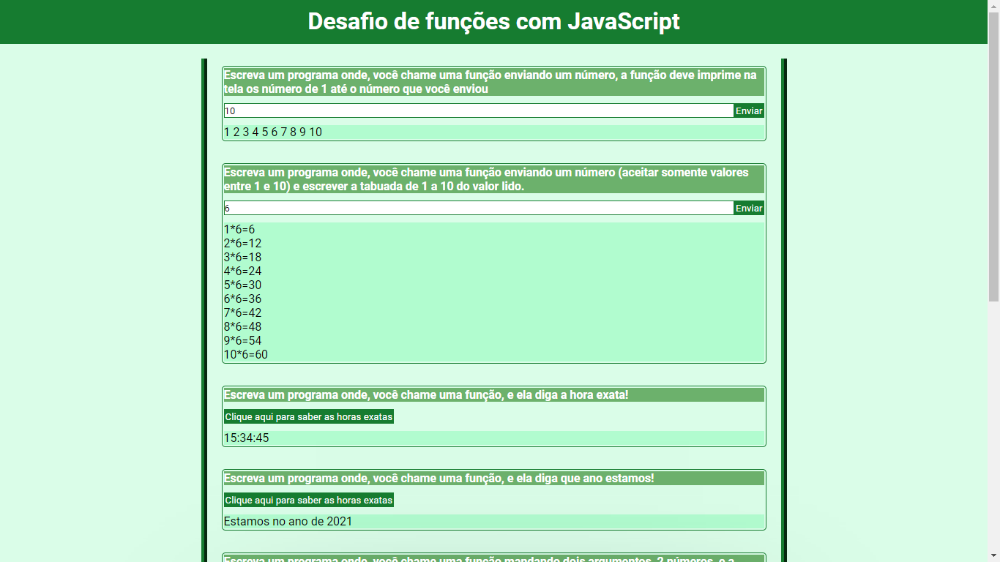
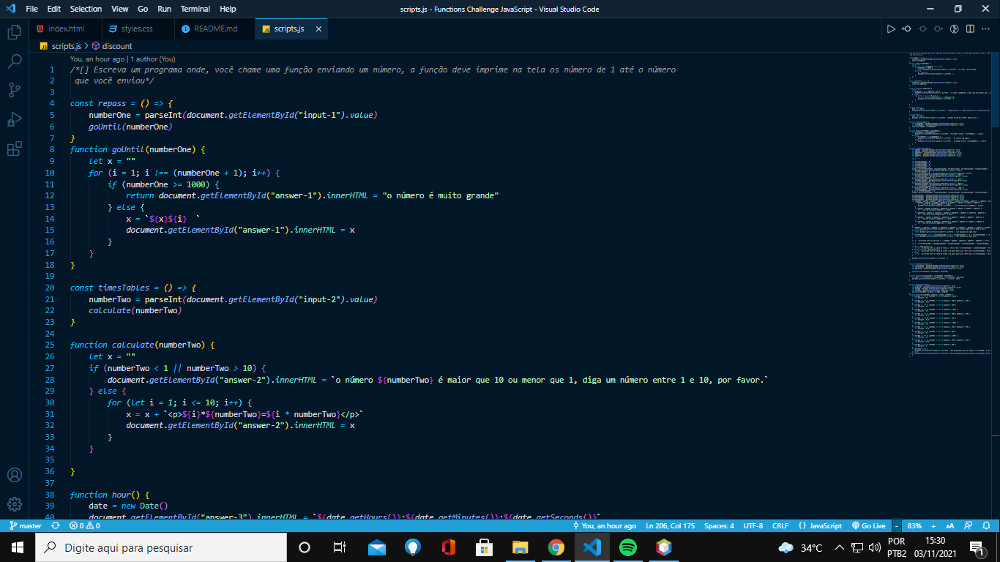

<h1>Desfio de Funções com JavaScript</h1>

Neste desafio, que a princípio era de apenas java script, inovei usando minhas técnicas já adquirida sobre html e css, e fiz um site com estilo, onde a informação era introduzida na tela, e, também, fiz todos os desafios em um programa só, desafiando a mim mesmo.

<a href="https://welderbm.github.io/Functions-Challenge-JavaScript/">clique aqui para ver o site.</a>
 
 
<label>
Visão do site:

</label>
 
 
<label>
primeiros códigos de exemplo:

</label>
