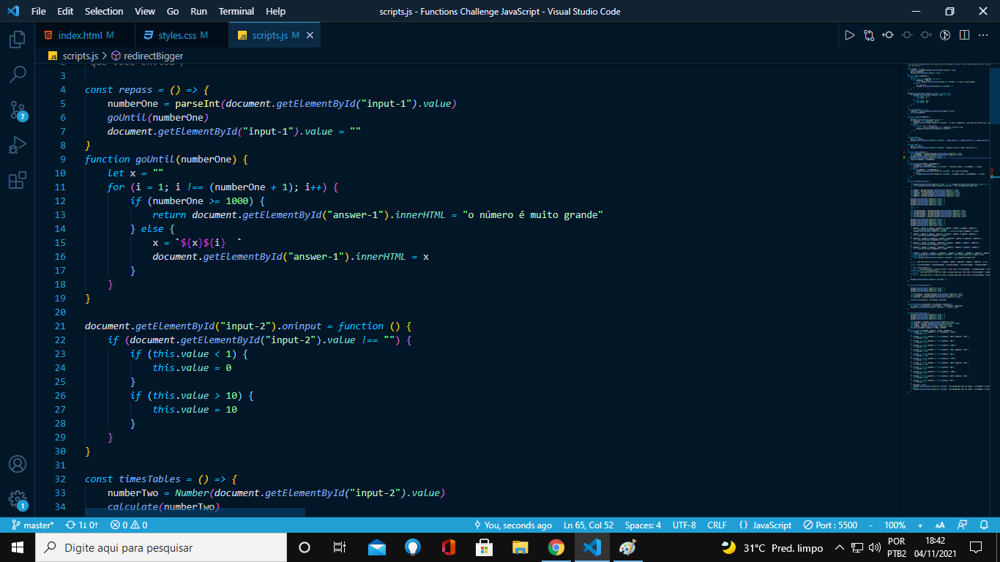
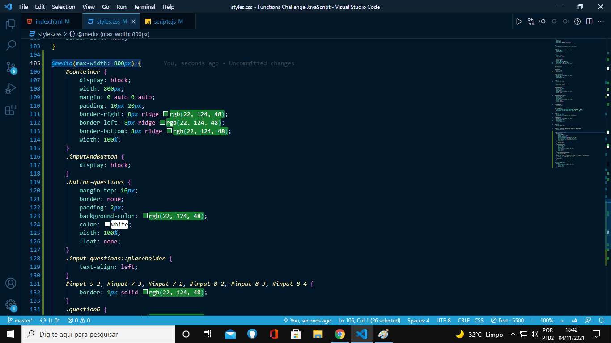

<h1>Desfio de Funções com JavaScript</h1>

<<<<<<< HEAD

Este foi um desafio proposto pelo Rodolfo Mori no curso Code Club, mas fui além do pedido e apliquei aprendizados que adquiri ao longo dessa jornada de programador: em vez de vários programas, fiz conectividade de todos os desafios em umúnico programa, vale ressaltar que essa prática serve apenas para fins didáticos, pois diminui a organização, mas contribui para uma boa interface Web; Sem ter chegado no módulo de responsividade, apliquei, por meio de pesquisas, ela em meu projeto; Este projeto, mais que um desafio de curso, foi um esforço pessoal.

 
<h2>Componentes da execução:</h2>
<ol>
<li>Estrutura HTML5</li>
<li>CSS</li>
<li>JavaScript baseado em funções</li>
<li>Responsividade</li>
</ol>
 
<h2>Habilidades adquiridas/ultilizadas</h2>
<li>Raciocínio lógico de programação</li>
<li>base em pesquisas para implementação</li>
<li>humildade de pedir ajuda</li>
<li>criatividade</li>
</ul>
=======

Neste desafio, que a princípio era de apenas java script, inovei usando minhas técnicas já adquirida sobre html e css, e fiz um site com estilo, onde a informação era introduzida na tela, e, também, fiz todos os desafios em um programa só, desafiando a mim mesmo.

<a href="https://welderbm.github.io/Functions-Challenge-JavaScript/">clique aqui para ver o site.</a>
 
>>>>>>> 1c1d4b585b2b27121d2093ba2d585ec643c7df29
 
<label>
Visão do site:

</label>
 
 
<label>
código javaScript de exemplo:

</label>
 
 
<label>
códigos CSS responsividade exemplo:

</label>

