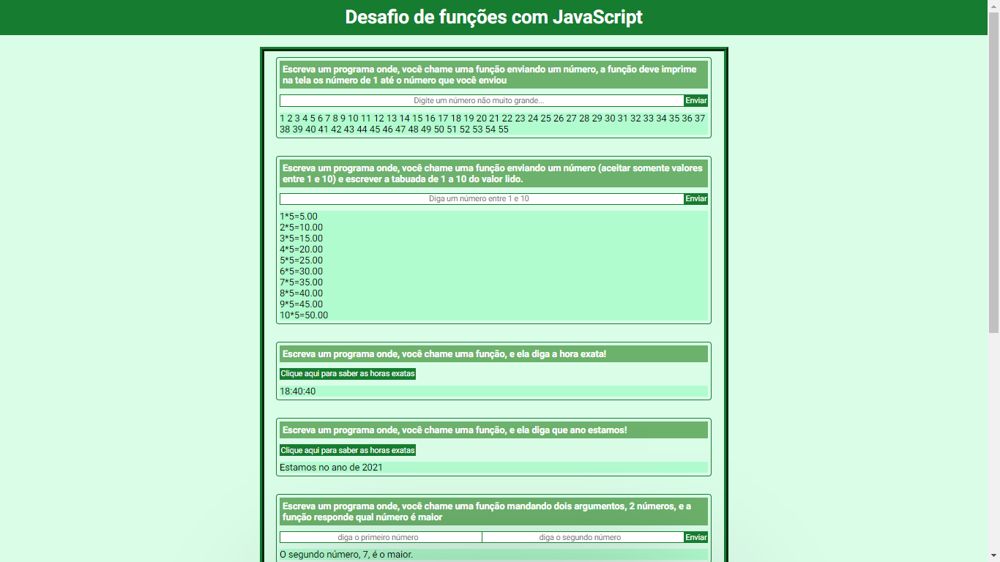

<h1>Function Challenge with JavaScript</h1>

In this project I applied lessons learned along this programmer journey: instead of several programs, I connected all the challenges in a single program; Without having reached the responsiveness module, I applied it, through research, to my project; This project, more than a course challenge, was a personal effort.

 
<a href="https://welderbm.github.io/Functions-Challenge-JavaScript/">Here is the site<a>
<h2>executions components:</h2>
<ol>
<li>HTML5 struture</li>
<li>CSS3</li>
<li>function based JavaScript</li>
<li>responsive</li>
</ol>
 
<h2>adquired/ultilized habililties</h2>
<li>programming logic</li>
<li>smart search</li>
<li>humility to ask for help</li>
<li>creativity</li>
</ul>
 

### Site view:
💥

### javaScript code exemple:
💢

### responsivity code exemples:
🤍

